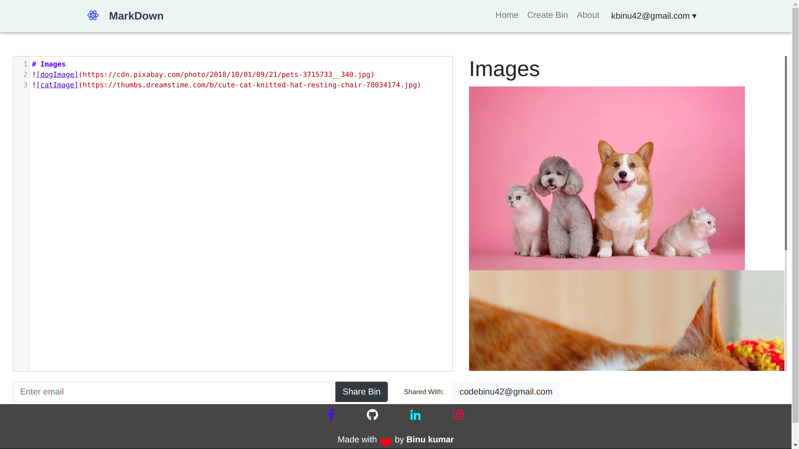
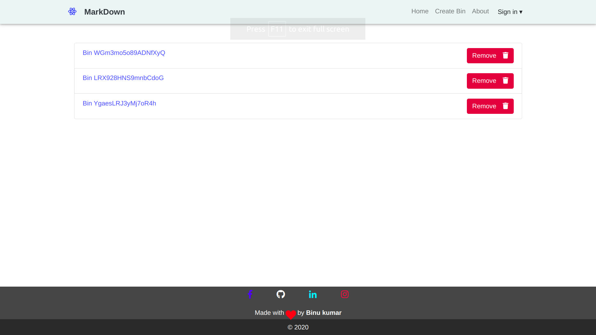
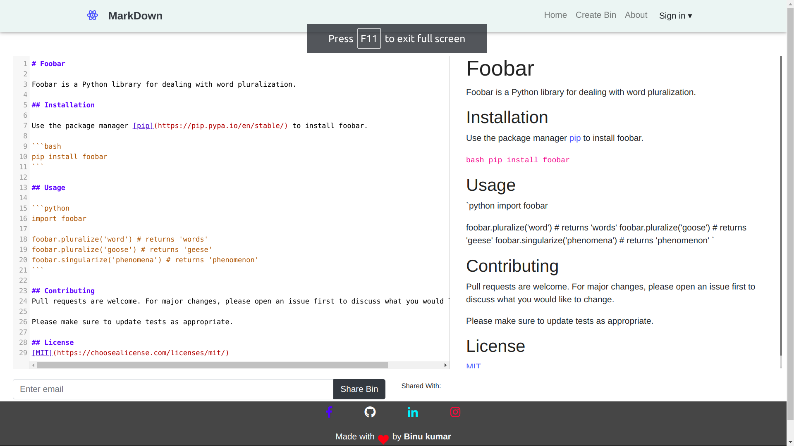

# Markdown
- creating readme of this repo with [this website](https://gitreadme.herokuapp.com/) FOR PRACTICAL EXAMPLE
- functions to our users:-
	- **create** mardown.
    - **share** markdown using users of our website.
    - *create example* to make it public for example and share with all users.
    
### Demo Images

